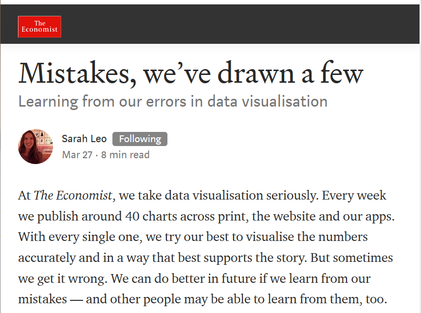
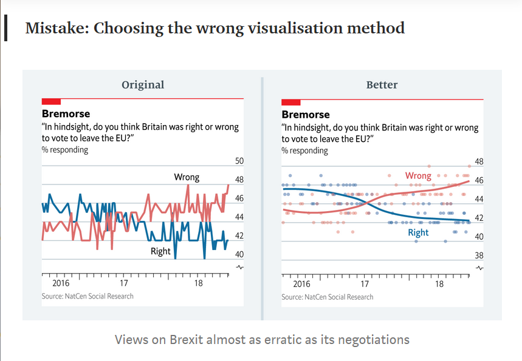
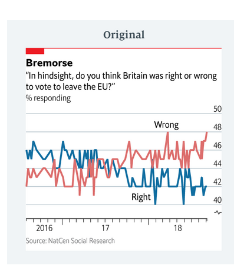
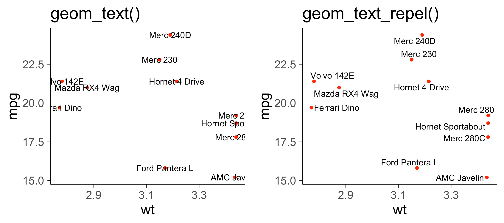
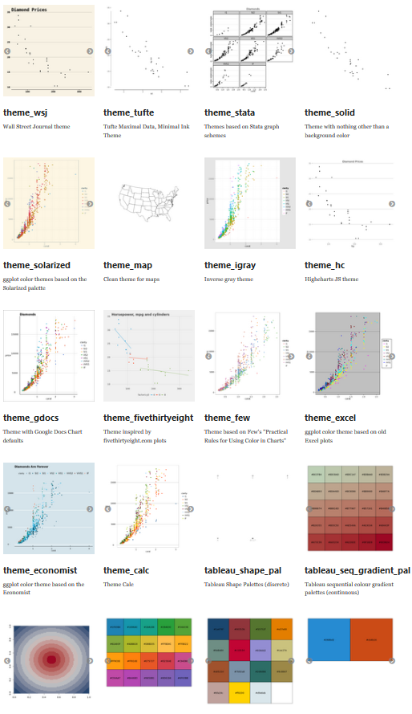

```{r setup, include=FALSE}
knitr::opts_chunk$set(crayon.enabled = TRUE)
library(xaringanthemer)
library(fansi)
library(magrittr)
library(tidyverse)
library(grid)
library(gridExtra)
library(icon)

mono_light(
  base_color = "#5d1451",
  header_font_google = google_font("Josefin Sans"),
  text_font_google   = google_font("Montserrat", "300", "300i"),
  code_font_google   = google_font("Quicksand")
)

load('.RData')

```

# Practicalities

Wi-Fi: Download Best Fiends!

PW: funandgames

---

# Introduction

.pull-left[
* Data analyst @Seriously
* Co-founder and organiser of codebar Helsinki
* Data vis enthusiast, fan of #tidytuesday
* Pro-bono data analyst for socio-economic causes
* Cat lady 

`r icon::fa("chrome")` https://kuprina.codes/

`r icon::fa("twitter")` @Kuprinasha

`r icon::fa("linkedin")` @anastasiakuprina
]


.pull-right[

]

---

# Seriously

.pull-left[
* Started in 2013
* Two offices - Helsinki & Los Angeles
* Two live games - Best Fiends and Best Fiends Forever
* One game in soft launch - Best Fiends Stars

Looking for:
* Data Scientist
* Game Economy Manager
* Senior Data Scientist
]

.pull-right[

]


---
# Plan for tonight

.pull-left[
* Visualisation in general
* Thinking behind ggplot
* Basic plot which will slowly turn into a complex one
]

.pull-right[

]

---
# General visualisation principles


---
# General visualisation principles


---
# General visualisation principles


---
# General visualisation principles


---
# General visualisation principles


---
# General visualisation principles


---
# General visualisation principles


---
# General visualisation principles


---
# General visualisation principles


---
# General visualisation principles: Who is it for?
## Audience & Questions
Shoutout to Storytelling with data - must-read!

http://www.storytellingwithdata.com/ 

#### - Who is the the main audience?
--

#### - What is the main point you want to convey? Only the "pearls"!
--

#### - What do you want the audience to know or do?
--

#### - What is the "mood"? Is this a celebration, or call-to-action, or something else? 
--

#### - Who is the decision maker? What biases does the audience have that could potentially affect their response to our message?

---
# Which chart to pick?

#### - Heatmap
Good for visualising tabular format and leveraging color to show the magnitute of the numbers

--
#### - Scatterplot
x & y relationship

--
#### - Line graphs
Most common with continuous data because a continuous line implies connection between the points

---
# Which chart to pick? #2

#### - Slopegraphs
Great for two time points comparisons; awful for many data points (unless you use color to accent those points audience must know about)

--
#### - Bar graphs 
Use instead of histograms (they're fairly hard to read for non-technical users). Best kept with 0 y axis starting point and bars being wider than whitespace between them

--
#### - Stacked bar & line
Harder to interpret change over time but good for low amount of data

--
#### - Pie chart
No.
Seriously no.


---
# Why no to pie charts?

* Do you think I like cats more than dogs?
* Do I like sushi more than pets?

.pull-left[

]
--
.pull-right[


]

---
# But I really need to show that I like cats slightly more than dogs!


---
# Back to vis principles

### Strip down & Build up
+ Remove all the noise: chart border, gridlines, data markers, clean up axis, label data directly next to the last data point

--
+ Use colour wisely to attract attention

--
+ Do not rely on defaults

--
+ Do not rotate axis text (52% slower reading time compared to normal text)

--
+ Z eye movement

--
+ Look away from the chart, look back - what's the first thing that you see? Is that what you want the audience to see first?

--
+ Move title and legend to upper-left corner; that way the audience learns how to read the chart before looking at the data

---
# Applying the principles

## Step 0: Starting point


---
# Applying the principles

## Step 1: Remove y axis


---

# Applying the principles

## Step 2: Remove grid


---
# Applying the principles

## Step 3: Strip down color


---
# Applying the principles

## Step 4: Add accent colour


---
# Applying the principles

## Step 5: Move title to the left


---
# Applying the principles

## Step 6: Increase font size


---
# Applying the principles

## Step 7: Add axis title


---

# Before and after

.pull-left[

]
.pull-right[

]

---

# The power of ggplot
```{r example_plots, echo=F}
# what's the best country for Riesling?

colors_for_chart <- c('#2a1a5e', '#696464')
vis_data <- wine_ratings %>%
  filter(variety == 'Riesling') %>%
  group_by(country) %>%
  summarise(average_rating = mean(points)) %>%
  na.omit() %>%
  arrange(desc(average_rating)) %>%
  mutate(rank = rank(desc(average_rating)),
         vis_color = ifelse(between(rank, 1, 3), '#2a1a5e',  '#696464'),
         country = factor(country,  levels = reorder(.$country, average_rating)))

basic <- ggplot(data = vis_data) +
  geom_bar(aes(x = country,
               y = average_rating,
               fill = vis_color),
           stat = 'identity') +
  labs(y = 'Average rating of all Rieslings',
       x = 'Country',
       title = 'Average Riesling wine rating by country')

edited <- ggplot(data = vis_data) +
  geom_bar(aes(x = country,
               y = average_rating,
               fill = vis_color),
           stat = 'identity') +
  geom_text(aes(x = country,
                y = average_rating + 5,
                label = round(average_rating, 1),
                color = vis_color)) +
  coord_flip() +
  scale_fill_manual(values = colors_for_chart) +
  scale_color_manual(values = colors_for_chart) +
  theme_classic() +
  scale_x_discrete(limits = rev(levels(vis_data$country))) +
  guides(fill = FALSE,
         color = FALSE) +
  theme(axis.text.y = element_text(color = rev(vis_data$vis_color)),
        axis.text.x = element_blank(),
        axis.ticks.x = element_blank(),
        axis.title.x = element_text(color = unique(vis_data$vis_color)[2]),
        panel.grid.minor = element_blank(),
        text = element_text(size = 16),
        plot.margin = margin(0.5, 2, 0.5, 0.5, "cm")) 

```

.pull-left[
### Basic ggplot
```{r plot-1, echo = F, warning = F}
# what's the best country for Riesling?
basic

```
]

.pull-right[
### Enhanced ggplot 
```{r echo = F, warning = F}
# what's the best country for Riesling?
edited +
  labs(y = 'Average rating of all Rieslings produced in a given country',
       x = '',
       title = 'Where does best rated Riesling come from?',
       subtitle = 'Average Riesling wine rating by country')

```
]

---

# Why extra libraries are useful?

```{r gridextra, include=F}

title_total <- textGrob(
  label = "Where does best rated Riesling come from?",
  x = unit(0, "lines"), 
  y = unit(0, "lines"),
  hjust = -0.1, vjust = 0,
  gp = gpar(fontsize = 18))


subtitle_total <- textGrob(
  label = "Average Riesling wine rating by country
  ",
  x = unit(0, "lines"), 
  y = unit(0, "lines"),
  hjust = -0.2, vjust = 0,
  gp = gpar(fontsize = 15))


foot_total <- textGrob(
  label = "Source: Kaggle Wine Reviews dataset
   By: @kuprinasha
  ",
  x = unit(0, "lines"), 
  y = unit(0, "lines"),
  hjust = -0.1, vjust = 0,
  gp = gpar(fontsize = 10,
            color = unique(vis_data$vis_color)[2]))

edited <- edited + labs(y = 'Average rating of all Rieslings produced in a given country',
       x = '')
margin <- unit(0.5, "line")
p_with_extra <- arrangeGrob(title_total, subtitle_total, edited, 
                       heights = unit.c(grobHeight(title_total) + 1.2*margin, 
                                        grobHeight(subtitle_total) + margin, 
                                        unit(1,"null")),
                       bottom = foot_total)

```

.pull-left[
### ggplot only

```{r echo=F, message = F, warning = F}
# what's the best country for Riesling?
edited +
  labs(y = 'Average rating of all Rieslings produced in a given country',
       x = '',
       title = 'Where does best rated Riesling come from?',
       subtitle = 'Average Riesling wine rating by country')

```

]

.pull-right[
### ggplot + helpers

```{r echo=F, message = F, warning = F}
# what's the best country for Riesling?
grid.newpage()
grid.draw(p_with_extra)

```
]

---
# Thinking behind ggplot


---
# Thinking behind ggplot 2


---
# What data do we need?


---
# How to get that data?

.pull-left[
```{r }
fake_data <- tibble(Robot_words = c('Beep', 'Boop', 'Woop'), 
                    Robot = c(2,3,0), 
                    Terminator = c(1,1,5)) 

head(fake_data)
```

]
.pull-right[
```{r }
fake_data_long <- tibble(Robot_words = c('Beep', 'Boop', 'Woop'), 
                    Robot = c(2,3,0), 
                    Terminator = c(1,1,5)) %>%
  gather(Type_of_robot, Frequency, -Robot_words)

head(fake_data_long)
```

]

---
.pull-left[
.smaller[
```{r }
ggplot(data = fake_data) +
  geom_point(aes(x = Robot_words, #<<
                 y = Robot, color = 'Robot'), size = 5) + 
  geom_point(aes(x = Robot_words, #<<
                 y = Terminator, color = 'Terminator'), size = 5) + 
  scale_color_manual(values = c('orange', 'darkgray')) +
  theme_classic() +
  labs(x = 'Common robot words',
       y = 'How often they appear in data',
       title = 'Mysterious robot word data',
       color = 'Robot type')

```
]
]

.pull-right[
```{r }
ggplot(data = fake_data_long) +
  geom_point(aes(x = Robot_words, #<<
                 y = Frequency, color = Type_of_robot), 
             size = 5) + 
  scale_color_manual(values = c('orange', 'darkgrey')) +
  theme_classic() +
  labs(x = 'Common robot words',
       y = 'How often they appear in data',
       title = 'Mysterious robot word data', 
       color = 'Robot type') 

```
]


---

# Let's make a few plots



### https://bit.ly/2CIDyG1

---
# Hands-on start!

```{r }
brexit <- readr::read_csv("https://raw.githubusercontent.com/rfordatascience/tidytuesday/master/data/2019/2019-04-16/brexit.csv")
```

---
# A bit of tidying

```{r }
brexit %>% glimpse
```
---
# A bit of tidying

```{r }
brexit %>% 
  rename(Wrong = percent_responding_wrong, #<<
         Right = percent_responding_right) #<<
```
---

# A bit of tidying

```{r }
brexit %>% 
  rename(Wrong = percent_responding_wrong,
         Right = percent_responding_right) %>%
  mutate(date = lubridate::dmy(date)) #<<
## BASE R ALTERNATIVE: as.Date(date, format = '%d/%m/%y')
```
---


# A bit of tidying

```{r }
brexit %>% 
  rename(Wrong = percent_responding_wrong,
       Right = percent_responding_right) %>%
  mutate(date = lubridate::dmy(date)) %>%
  gather(category, percentage, -date) #<<

```
---

# A bit of tidying

```{r }
brexit %>% 
  rename(Wrong = percent_responding_wrong,
       Right = percent_responding_right) %>%
  mutate(date = lubridate::dmy(date)) %>%
  gather(category, percentage, -date) %>%
  mutate(percentage = percentage / 100) #<<

```
---

# A bit of tidying

```{r }
brexit <- brexit %>% #<<
  rename(Wrong = percent_responding_wrong,
       Right = percent_responding_right) %>%
  mutate(date = lubridate::dmy(date)) %>%
  gather(category, percentage, -date) %>%
  mutate(percentage = percentage / 100)

```
---


## Our goal:


---
.left-code[

```{r plot-canvas, eval=FALSE}
ggplot(data = brexit) #<<
```

]
.right-plot[
```{r plot-canvas-out, ref.label="plot-canvas", echo=FALSE}
```
]

--
### Let's add the lines
---


.left-code[

```{r plot-line, eval=FALSE}
ggplot(data = brexit) +
  geom_line(aes(x = date, #<<
                y = percentage, #<<
                group = category)) #<<

```
]
.right-plot[
```{r plot-line-out, ref.label="plot-line", echo=FALSE}
```
]

--

### Let's add the color

---
.left-code[
```{r plot-color, eval=FALSE}
ggplot(data = brexit) +
  geom_line(aes(x = date,
                y = percentage,
                group = category,
                colour = category)) #<<
```
]

.right-plot[
```{r plot-color-out, ref.label="plot-color", echo=FALSE}
```
]

--

### Let's add the right colors

---

.left-code[
```{r plot-colors, eval=FALSE}
ggplot(data = brexit) +
  geom_line(aes(x = date,
                y = percentage,
                group = category,
                colour = category)) +
  scale_color_manual(values = c("#116ea0", "#dd6e6d")) #<<
```
]

.right-plot[
```{r plot-colors-out, ref.label="plot-colors", echo=FALSE}
```
]

--

### Now we want to remove the ugly categories


---

.left-code[
```{r plot-nocat, eval=FALSE}
ggplot(data = brexit) +
  geom_line(aes(x = date,
                y = percentage,
                group = category,
                colour = category)) +
  scale_color_manual(values = c("#116ea0", "#dd6e6d")) +
  guides(colour = FALSE) #<<
```
]
.right-plot[
```{r plot-nocat-out, ref.label="plot-nocat", echo=FALSE}
```
]

--

### theme_classic() to make everything better <3

---

.left-code[
```{r plot-classic, eval=FALSE}
ggplot(data = brexit) +
  geom_line(aes(x = date,
                y = percentage,
                group = category,
                colour = category)) +
  scale_color_manual(values = c("#116ea0", "#dd6e6d")) +
  guides(colour = FALSE) +
  theme_classic() #<<
```
]
.right-plot[
```{r plot-classic-out, ref.label="plot-classic", echo=FALSE}
```
]

--

### Let's add the gridlines according to the reference plot

---
.pull-left[

]
.pull-right[
```{r plot-classic-out, ref.label="plot-classic", echo=FALSE}
```
]

--

### Essentially what we have left is:

- Adding labels
- Increasing size of lines & font
- Changing x and y axis
- Adding titles & subtitles

---
.left-code[
```{r plot-fontsize, eval=FALSE}
ggplot(data = brexit) +
  geom_line(aes(x = date,
                y = percentage,
                group = category,
                colour = category)) +
  scale_color_manual(values = c("#116ea0", "#dd6e6d")) +
  guides(colour = FALSE) +
  theme_classic(base_size = 18) #<< 
```
]
.right-plot[
```{r plot-fontsize-out, ref.label="plot-fontsize", echo=FALSE}
```
]

--

### Let's increase line size, too
---

.left-code[
```{r plot-linesize, eval=FALSE}
ggplot(data = brexit) +
  geom_line(aes(x = date,
                y = percentage,
                group = category,
                colour = category),
            size = 2) + #<<
  scale_color_manual(values = c("#116ea0", "#dd6e6d")) +
  guides(colour = FALSE) +
  theme_classic(base_size = 18)
```
]
.right-plot[
```{r plot-linesize-out, ref.label="plot-linesize", echo=FALSE}
```
]
 
--

### Now let's fix the axes (x first)

---
.left-code[
```{r plot-dates, eval=FALSE}
ggplot(data = brexit) +
  geom_line(aes(x = date,
                y = percentage,
                group = category,
                colour = category),
            size = 2) +
  scale_color_manual(values = c("#116ea0", "#dd6e6d")) +
  scale_x_date(date_breaks = "6 months", #<<
               date_labels = "%b '%y") + #<<
  guides(colour = FALSE) +
  theme_classic(base_size = 18)

```
]

.right-plot[
```{r plot-dates-out, ref.label="plot-dates", echo=FALSE}
```
]

--

### Not ideal for our situation but shows the date_breaks trick!

--
.pull-right[
### Onto the y-axis!
]
---
# Introducing scales!

```{r message=FALSE, warning=FALSE}
require(scales) || install.packages('scales')
```

.pull-left[
#### - percent()
```{r }
percent(0.04)
```


#### - number()
```{r }
number(2405050)
```
]

.pull-right[
#### - dollar()
```{r }
dollar(1500)
```

#### - comma()
```{r }
comma(15000000)
```
]

---

.left-code[
```{r plot-percent, eval=FALSE}
ggplot(data = brexit) +
  geom_line(aes(x = date,
                y = percentage,
                group = category,
                colour = category),
            size = 2) +
  scale_color_manual(values = c("#116ea0", "#dd6e6d")) +
  scale_x_date(date_breaks = "6 months", 
               date_labels = "%b '%y") + 
  scale_y_continuous(breaks = c(seq(0.38, 0.48, 0.02)), #<<
                     labels = percent) + #<<
  coord_cartesian(ylim = c(0.38,max(brexit$percentage))) + #<<
  guides(colour = FALSE) +
  theme_classic(base_size = 18)

```
]

.right-plot[
```{r plot-percent-out, ref.label="plot-percent", echo=FALSE}
```
]

--

### Original chart doesn't have any decimal points, though

---
.left-code[
```{r plot-decimals, eval=FALSE}
ggplot(data = brexit) +
  geom_line(aes(x = date,
                y = percentage,
                group = category,
                colour = category),
            size = 2) +
  scale_color_manual(values = c("#116ea0", "#dd6e6d")) +
  scale_x_date(date_breaks = "6 months", 
               date_labels = "%b '%y") + 
  scale_y_continuous(breaks = c(seq(0.38, 0.48, 0.02)), 
                     labels = percent_format(accuracy = 1)) + #<<
  coord_cartesian(ylim = c(0.38,max(brexit$percentage))) +
  guides(colour = FALSE) +
  theme_classic(base_size = 18)

```
]

.right-plot[
```{r plot-decimals-out, ref.label="plot-decimals", echo=FALSE}
```
]

--

### Moving y axis to the right side!

---

.left-code[
```{r plot-right, eval=FALSE}
ggplot(data = brexit) +
  geom_line(aes(x = date,
                y = percentage,
                group = category,
                colour = category),
            size = 2) +
  scale_color_manual(values = c("#116ea0", "#dd6e6d")) +
  scale_x_date(date_breaks = "6 months", 
               date_labels = "%b '%y") + 
  scale_y_continuous(breaks = c(seq(0.38, 0.48, 0.02)), 
                     labels = percent_format(accuracy = 1),
                     position = 'right') + #<<
  coord_cartesian(ylim = c(0.38,max(brexit$percentage))) +
  guides(colour = FALSE) +
  theme_classic(base_size = 18)

```
]

.right-plot[
```{r plot-right-out, ref.label="plot-right", echo=FALSE}
```
]

---
# How are we doing?

.pull-left[

]
.pull-right[
```{r plot-right-out, ref.label="plot-right", echo=FALSE}
```

TO-DO:

- Adding labels
- Adding titles & subtitles
- Adding the grid back
]

---

.left-code[
.smaller[
```{r plot-grid, eval=FALSE}
ggplot(data = brexit) +
  geom_line(aes(x = date,
                y = percentage,
                group = category,
                colour = category),
            size = 2) +
  scale_color_manual(values = c("#116ea0", "#dd6e6d")) +
  scale_x_date(date_breaks = "6 months", 
               date_labels = "%b '%y") + 
  scale_y_continuous(breaks = c(seq(0.38, 0.48, 0.02)), 
                     labels = percent_format(accuracy = 1),
                     position = 'right') +
  coord_cartesian(ylim = c(0.38,max(brexit$percentage))) +
  guides(colour = FALSE) +
  theme_classic(base_size = 18) + 
  theme(panel.grid.major.y = element_line( #<<
          colour = '#c2cdd4', #<<
          linetype = 'solid', #<<
          size = 0.5 #<<
        ))

```
]
]

.right-plot[
```{r plot-grid-out, ref.label="plot-grid", echo=FALSE}
```
]

--

### Now onto the labels!

---

# Introducing ggrepel!

```{r message=FALSE, warning=FALSE}
require(ggrepel) || install.packages('ggrepel')
```



---

# Creating data for ggrepel
.pull-left[

]

.pull-right[
```{r }
brexit %>% 
  group_by(category) %>%
  mutate(rank = rank(desc(date), ties.method = "first")) #<<
```
]

---
.pull-left[

]

.pull-right[
```{r }
brexit <- brexit %>% #<<
  group_by(category) %>%
  mutate(rank = rank(desc(date), ties.method = "first"),
         label_data = if_else(rank == 15, #<< 
                              category, #<< 
                              NA_character_)) #<< 
```
]


---

.left-code[
.smaller[
```{r plot-ggrepel, eval=FALSE}
ggplot(data = brexit) +
  geom_line(aes(x = date,
                y = percentage,
                group = category,
                colour = category),
            size = 2) +
  geom_label_repel(data = brexit, #<<
                  aes(x = date, #<<
                      y = percentage, #<<
                      colour = label_data, #<<
                      label = label_data)) + #<<
  scale_color_manual(values = c("#116ea0", "#dd6e6d")) +
  scale_x_date(date_breaks = "6 months", 
               date_labels = "%b '%y") + 
  scale_y_continuous(breaks = c(seq(0.38, 0.48, 0.02)), 
                     labels = percent_format(accuracy = 1),
                     position = 'right') +
  coord_cartesian(ylim = c(0.38,max(brexit$percentage))) +
  guides(colour = FALSE) +
  theme_classic(base_size = 18) + 
  theme(panel.grid.major.y = element_line(
          colour = '#c2cdd4', 
          linetype = 'solid', 
          size = 0.5 
        ))
```
]
]

.right-plot[
```{r plot-ggrepel-out, ref.label="plot-ggrepel", echo=FALSE}
```
]

---

.left-code[
.smaller[
```{r plot-ggrepelnudge, eval=FALSE}
ggplot(data = brexit) +
  geom_line(aes(x = date,
                y = percentage,
                group = category,
                colour = category),
            size = 2) +
  geom_label_repel(data = brexit,
                  aes(x = date, 
                      y = percentage, 
                      colour = label_data, 
                      label = label_data),
                  nudge_y = 0.01, #<<
                  na.rm = TRUE, #<< 
                  size = 10) + #<< 
  scale_color_manual(values = c("#116ea0", "#dd6e6d")) +
  scale_x_date(date_breaks = "6 months", 
               date_labels = "%b '%y") + 
  scale_y_continuous(breaks = c(seq(0.38, 0.48, 0.02)), 
                     labels = percent_format(accuracy = 1),
                     position = 'right') +
  coord_cartesian(ylim = c(0.38,max(brexit$percentage))) +
  guides(colour = FALSE) +
  theme_classic(base_size = 18) + 
  theme(panel.grid.major.y = element_line(
          colour = '#c2cdd4', 
          linetype = 'solid', 
          size = 0.5 
        ))
```
]
]

.right-plot[
```{r plot-ggrepelnudge-out, ref.label="plot-ggrepelnudge", echo=FALSE}
```
]

---

# Clean up time

```{r eval=FALSE}
ggplot(data = brexit) +#<<
  geom_line(aes(x = date,#<<
                y = percentage,#<<
                group = category,
                colour = category), #<<
             size = 2) +
  geom_label_repel(data = brexit, #<<
                  aes(x = date, #<<
                      y = percentage, #<<
                      colour = label_data, #<<
                      label = label_data),
                  nudge_y = 0.01, 
                  na.rm = TRUE, 
                  size = 10) + 
  scale_color_manual(values = c("#116ea0", "#dd6e6d")) +
  scale_x_date(date_breaks = "6 months", 
               date_labels = "%b '%y") + 
  scale_y_continuous(breaks = c(seq(0.38, 0.48, 0.02)), 
                     labels = percent_format(accuracy = 1),
                     position = 'right') +
  coord_cartesian(ylim = c(0.38,max(brexit$percentage))) +
  guides(colour = FALSE) +
  theme_classic(base_size = 18) + 
  theme(panel.grid.major.y = element_line(
          colour = '#c2cdd4', 
          linetype = 'solid', 
          size = 0.5 
        ))
```


---

.left-code[
.smaller[
```{r plot-reorder, eval=FALSE}
ggplot(data = brexit,
       aes(x = date, #<<
           y = percentage, #<<
           colour = category)) + #<<
  geom_line(aes(group = category), #<<
             size = 2) +
  geom_label_repel(aes(label = label_data), #<<
                  nudge_y = 0.01, 
                  na.rm = TRUE, 
                  size = 10) + 
  scale_color_manual(values = c("#116ea0", "#dd6e6d")) +
  scale_x_date(date_breaks = "6 months", 
               date_labels = "%b '%y") + 
  scale_y_continuous(breaks = c(seq(0.38, 0.48, 0.02)), 
                     labels = percent_format(accuracy = 1),
                     position = 'right') +
  coord_cartesian(ylim = c(0.38,max(brexit$percentage))) +
  guides(colour = FALSE) +
  theme_classic(base_size = 18) + 
  theme(panel.grid.major.y = element_line(
          colour = '#c2cdd4', 
          linetype = 'solid', 
          size = 0.5 
        ))
```
]
]
.right-plot[
```{r plot-reorder-out, ref.label="plot-reorder", echo=FALSE}
```
]

---

# Removing axis titles

.left-code[
.tiny[
```{r plot-axistitle, eval=FALSE}
ggplot(data = brexit,
       aes(x = date, 
           y = percentage, 
           colour = category)) + 
  geom_line(aes(group = category),
             size = 2) +
  geom_label_repel(aes(label = label_data), 
                  nudge_y = 0.01, 
                  na.rm = TRUE, 
                  size = 10) + 
  scale_color_manual(values = c("#116ea0", "#dd6e6d")) +
  scale_x_date(date_breaks = "6 months", 
               date_labels = "%b '%y") + 
  scale_y_continuous(breaks = c(seq(0.38, 0.48, 0.02)), 
                     labels = percent_format(accuracy = 1),
                     position = 'right') +
  coord_cartesian(ylim = c(0.38,max(brexit$percentage))) +
  guides(colour = FALSE) +
  theme_classic(base_size = 18) + 
  theme(panel.grid.major.y = element_line(
          colour = '#c2cdd4', 
          linetype = 'solid', 
          size = 0.5 
        ),
        axis.title.x = element_blank(), #<<
        axis.title.y = element_blank()) #<<
```
]
]

.right-plot[
```{r plot-axistitle-out, ref.label="plot-axistitle", echo=FALSE}
```
]
---

### Assign the above to {p_original}
```{r}
p_original <- ggplot(data = brexit, #<<
       aes(x = date, 
           y = percentage, 
           colour = category)) + 
  geom_line(aes(group = category),
             size = 2) +
  geom_label_repel(aes(label = label_data), 
                  nudge_y = 0.01, 
                  na.rm = TRUE, 
                  size = 10) + 
  scale_color_manual(values = c("#116ea0", "#dd6e6d")) +
  scale_x_date(date_breaks = "6 months", 
               date_labels = "%b '%y") + 
  scale_y_continuous(breaks = c(seq(0.38, 0.48, 0.02)), 
                     labels = percent_format(accuracy = 1, PREFIX = ''),
                     position = 'right') +
  coord_cartesian(ylim = c(0.38, max(brexit$percentage))) +
  guides(colour = FALSE) +
  theme_classic(base_size = 18) + 
  theme(panel.grid.major.y = element_line(
          colour = '#c2cdd4', 
          linetype = 'solid', 
          size = 0.5 
        ),
        axis.title.x = element_blank(), #<<
        axis.title.y = element_blank()) #<<
```
---

# Introducing: gridExtra

```{r message=FALSE, warning=FALSE}
require(gridExtra, grid) || install.packages('gridExtra', 'grid')
```

### GROBs

#### = graphical objects

--

### grid.arrange()

#### drawing on device (e.g., "Plots" in the editor)

--

### arrangeGrob()

#### more complex layouts


---


.pull-left[
.smaller[
```{r }
super_quick_plot <- ggplot(data = datasets::iris) +
  geom_point(aes(x = Sepal.Length,
                 y = Petal.Length,
                 colour = Species)) +
  theme_classic() +
  ggtitle('Lengths of iris sepals and petals') +
  guides(colour = guide_legend(override.aes = list(size=4))) +
  theme(legend.position="top")

super_quick_plot
```
]
]

.pull-right[
.smaller[
```{r }
super_quick_plot2 <- ggplot(data = datasets::iris) +
  geom_point(aes(x = Sepal.Width,
                 y = Petal.Width,
                 colour = Species)) +
  theme_classic() +
  ggtitle('Widths of iris sepals and petals') +
  guides(colour = guide_legend(override.aes = list(size=4))) +
  theme(legend.position="top")

super_quick_plot2
```
]
]

---

# Grid Extra magic

```{r}

grid.arrange(super_quick_plot, 
             super_quick_plot2,
             ncol=2)
```

--


```{r}

grid.arrange(super_quick_plot, 
             super_quick_plot2,
             nrow=2)
```

---

```{r}

fake_space <- rectGrob(gp=gpar(fill="white",
                               col = "white"))
text <- textGrob("Beep Boop I love flowers")

grid.arrange(super_quick_plot, 
             fake_space,
             super_quick_plot2,
             text,
             nrow=2)

```

---

### GridExtra for special layouts in one chart

.pull-left[
```{r}
# Step 1: Create grobs
title.grob <- textGrob("Bremorse",
  gp = gpar(fontsize = 22))

foot.grob <- textGrob(
  label = "Source: NatCen Social Research",
  gp = gpar(fontsize = 15))

# Step 2: Arrange grobs
p_original_grid <- arrangeGrob(p_original, 
                  top = title.grob,
                  bottom = foot.grob)

```
]
.pull-right[
```{r }
# Step 3: Draw the arranged grob
grid.draw(p_original_grid)
```
]

---

.pull-left[
```{r}
title.grob <- textGrob("Bremorse",
  x = unit(0, "lines"), #<<
  y = unit(0, "lines"), #<<
  gp = gpar(fontsize = 22))

foot.grob <- textGrob(
  label = "Source: NatCen Social Research",
  x = unit(0, "lines"), #<<
  y = unit(0, "lines"), #<<
  gp = gpar(fontsize = 15))

p_original_grid <- arrangeGrob(p_original, 
                  top = title.grob,
                  bottom = foot.grob)

```
]

.pull-right[
```{r }
grid.draw(p_original_grid)
```
]

--

### Hmm


---

.pull-left[
```{r}
title.grob <- textGrob("Bremorse",
  x = unit(0, "lines"),
  y = unit(0, "lines"), 
  hjust = -0.1, #<<
  gp = gpar(fontsize = 22))

foot.grob <- textGrob(
  label = "Source: NatCen Social Research",
  x = unit(0, "lines"), 
  y = unit(0, "lines"), 
  hjust = -0.1, #<<
  gp = gpar(fontsize = 15))

p_original_grid <- arrangeGrob(p_original, 
                  top = title.grob,
                  bottom = foot.grob)

```
]

.pull-right[
```{r }
grid.draw(p_original_grid)
```
]

--

### Footer is too low :O


---

.pull-left[
```{r}
title.grob <- textGrob("Bremorse",
  x = unit(0, "lines"),
  y = unit(0, "lines"), 
  hjust = -0.1, 
  gp = gpar(fontsize = 22))

foot.grob <- textGrob(
  label = "Source: NatCen Social Research",
  x = unit(0, "lines"), 
  y = unit(0, "lines"), 
  hjust = -0.1, 
  vjust = -0.2, #<<
  gp = gpar(fontsize = 15))

p_original_grid <- arrangeGrob(p_original, 
                  top = title.grob,
                  bottom = foot.grob)

```
]

.pull-right[
```{r }
grid.draw(p_original_grid)
```
]

---

# Introducing ggthemes!

```{r }
require(ggthemes) || install.packages('ggthemes')
```



---

.left-code[
```{r plot-economist, eval=FALSE}
p_original + 
  ggthemes::scale_color_economist()
```
]

.right-plot[
```{r plot-economist-out, ref.label="plot-economist", echo=FALSE}
```
]

---

.left-code[
```{r plot-excel, eval=FALSE}
p_original + 
  ggthemes::scale_color_excel()
```
]

.right-plot[
```{r plot-excel-out, ref.label="plot-excel", echo=FALSE}
```
]

---

# Introducing RColorBrewer

```{r }
require(RColorBrewer) || install.packages('RColorBrewer')
```


---
.pull-left[
```{r }
ggplot(data = datasets::iris) +
  geom_point(aes(x = Petal.Width,
                 y = Petal.Length,
                 colour = Species)) +
  theme_classic() +
  scale_color_brewer(palette = 'Set2')
```
]


.pull-right[
```{r }
ggplot(data = datasets::iris) +
  geom_point(aes(x = Petal.Width,
                 y = Species,
                 color = Petal.Length)) +
  theme_classic() +
  scale_color_distiller(palette = "RdYlBu")
```
]


---
# Do-s summary

- Do not use defaults, fastest way to get rid of them is using theme_classic() or similar

--

- labs() is very useful and quick for all axis/legend titles

--

- Use pre-made palettes for discrete data from RColorBrewer

--

- Use scales to ensure correct y-axis without extra effort

--

- Set base font size inside theme() or theme_classic()

--

- geom_text_repel / geom_label_repel for easier reading!

--

- theme(legend.position = 'top') is super quick but makes visualisation easier to read