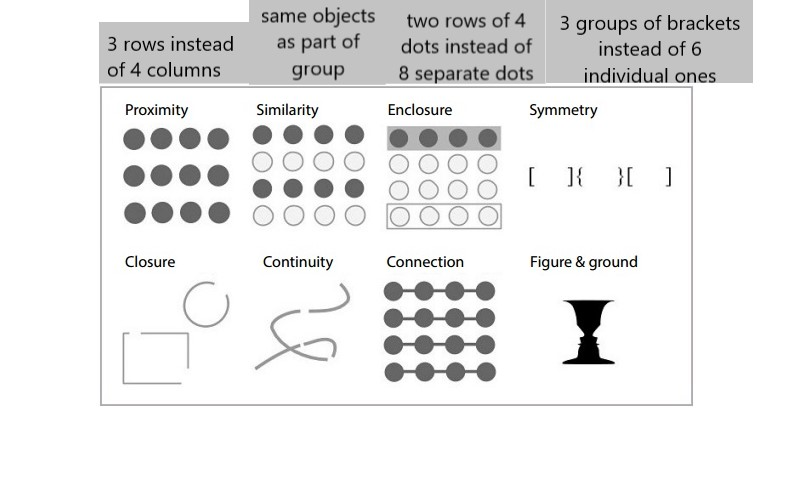
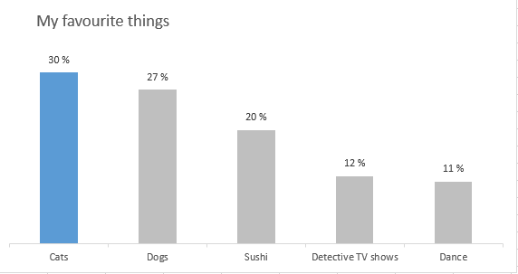

```{r setup, include=FALSE}
knitr::opts_chunk$set(crayon.enabled = TRUE)
library(xaringanthemer)
library(fansi)
library(magrittr)
library(tidyverse)
library(grid)
library(gridExtra)
library(icon)

mono_light(
  base_color = "#5d1451",
  header_font_google = google_font("Josefin Sans"),
  text_font_google   = google_font("Montserrat", "300", "300i"),
  code_font_google   = google_font("Quicksand")
)

wine_ratings <- readr::read_csv('data_wine.csv')

```


# Introduction

.pull-left[
* Data analyst @Seriously
* Co-founder and organiser of codebar Helsinki
* Data vis enthusiast, fan of #tidytuesday
* Pro-bono data analyst for socio-economic causes
* Cat lady 

`r icon::fa("chrome")` https://kuprina.codes/

`r icon::fa("twitter")` @Kuprinasha

`r icon::fa("linkedin")` @anastasiakuprina
]


.pull-right[

]

---

# Seriously

.pull-left[
* Started in 2013
* Two offices - Helsinki & Los Angeles
* Two live games - Best Fiends and Best Fiends Forever
* One game in soft launch - Best Fiends Stars

Looking for:
* Data Scientist
* Game Economy Manager
* Senior Data Scientist
]

.pull-right[

]


---
# Plan for tonight

.pull-left[
* Visualisation in general
* Thinking behind ggplot
* Basic plots - we'll cover a few main ones
* More complex plots - replicating a few complex charts
]

.pull-right[

]

---
# General visualisation principles


---
# General visualisation principles


---
# General visualisation principles


---
# General visualisation principles


---
# General visualisation principles




---
# General visualisation principles


---
# General visualisation principles


---
# General visualisation principles


---
# General visualisation principles


---
# General visualisation principles: Who is it for?
## Audience & Questions
Shoutout to Storytelling with data - must-read!

http://www.storytellingwithdata.com/ 

#### - Who is the the main audience?
--

#### - What is the main point you want to convey? Only the "pearls"!
--

#### - What do you want the audience to know or do?
--

#### - What is the "mood"? Is this a celebration, or call-to-action, or something else? 
--

#### - Who is the decision maker? What biases does the audience have that could potentially affect their response to our message?

---
# Which chart to pick?

#### - Heatmap
Good for visualising tabular format and leveraging color to show the magnitute of the numbers

--
#### - Scatterplot
x & y relationship

--
#### - Line graphs
Most common with continuous data because a continuous line implies connection between the points

---
# Which chart to pick? #2

#### - Slopegraphs
Great for two time points comparisons; awful for many data points (unless you use color to accent those points audience must know about)

--
#### - Bar graphs 
Use instead of histograms (they're fairly hard to read for non-technical users). Best kept with 0 y axis starting point and bars being wider than whitespace between them

--
#### - Stacked bar & line
Harder to interpret change over time but good for low amount of data

--
#### - Pie chart
No.
Seriously no.


---
# Why no to pie charts?

* Do you think I like cats more than dogs?
* Do I like sushi more than pets?

.pull-left[

]
--
.pull-right[


]

---
# But I really need to show that I like cats slightly more than dogs!


---
# Back to vis principles

### Strip down & Build up
+ Remove all the noise: chart border, gridlines, data markers, clean up axis, label data directly next to the last data point

--
+ Use colour wisely to attract attention

--
+ Do not rely on defaults

--
+ Do not rotate axis text (52% slower reading time compared to normal text)

--
+ Z eye movement

--
+ Look away from the chart, look back - what's the first thing that you see? Is that what you want the audience to see first?

--
+ Move title and legend to upper-left corner; that way the audience learns how to read the chart before looking at the data

---
# Applying the principles

## Step 0: Starting point


---
# Applying the principles

## Step 1: Remove y axis


---

# Applying the principles

## Step 2: Remove grid


---
# Applying the principles

## Step 3: Strip down color


---
# Applying the principles

## Step 4: Add accent colour


---
# Applying the principles

## Step 5: Move title to the left


---
# Applying the principles

## Step 6: Increase font size


---
# Applying the principles

## Step 7: Add axis title


---

# Before and after

.pull-left[

]
.pull-right[

]

---

# The power of ggplot
```{r example_plots, include=F}
# what's the best country for Riesling?

colors_for_chart <- c('#2a1a5e', '#696464')
vis_data <- wine_ratings %>%
  filter(variety == 'Riesling') %>%
  group_by(country) %>%
  summarise(average_rating = mean(points)) %>%
  na.omit() %>%
  arrange(desc(average_rating)) %>%
  mutate(rank = rank(desc(average_rating)),
         vis_color = ifelse(between(rank, 1, 3), '#2a1a5e',  '#696464'),
         country = factor(country,  levels = reorder(.$country, average_rating)))

basic <- ggplot(data = vis_data) +
  geom_bar(aes(x = country,
               y = average_rating,
               fill = vis_color),
           stat = 'identity') +
  labs(y = 'Average rating of all Rieslings',
       x = 'Country',
       title = 'Average Riesling wine rating by country')

edited <- ggplot(data = vis_data) +
  geom_bar(aes(x = country,
               y = average_rating,
               fill = vis_color),
           stat = 'identity') +
  geom_text(aes(x = country,
                y = average_rating + 5,
                label = round(average_rating, 1),
                color = vis_color)) +
  coord_flip() +
  scale_fill_manual(values = colors_for_chart) +
  scale_color_manual(values = colors_for_chart) +
  theme_classic() +
  scale_x_discrete(limits = rev(levels(vis_data$country))) +
  guides(fill = FALSE,
         color = FALSE) +
  theme(axis.text.y = element_text(color = rev(vis_data$vis_color)),
        axis.text.x = element_blank(),
        axis.ticks.x = element_blank(),
        axis.title.x = element_text(color = unique(vis_data$vis_color)[2]),
        panel.grid.minor = element_blank(),
        text = element_text(size = 16),
        plot.margin = margin(0.5, 2, 0.5, 0.5, "cm")) 

```

.pull-left[
### Basic ggplot
```{r plot-1, message = F, warning = F}
# what's the best country for Riesling?
basic

```
]

.pull-right[
### Enhanced ggplot 
```{r message = F, warning = F}
# what's the best country for Riesling?
edited +
  labs(y = 'Average rating of all Rieslings produced in a given country',
       x = '',
       title = 'Where does best rated Riesling come from?',
       subtitle = 'Average Riesling wine rating by country')

```
]

---

# Why extra libraries are useful?

```{r gridextra, include=F}

title_total <- textGrob(
  label = "Where does best rated Riesling come from?",
  x = unit(0, "lines"), 
  y = unit(0, "lines"),
  hjust = -0.1, vjust = 0,
  gp = gpar(fontsize = 18))


subtitle_total <- textGrob(
  label = "Average Riesling wine rating by country
  ",
  x = unit(0, "lines"), 
  y = unit(0, "lines"),
  hjust = -0.2, vjust = 0,
  gp = gpar(fontsize = 15))


foot_total <- textGrob(
  label = "Source: Kaggle Wine Reviews dataset
   By: @kuprinasha
  ",
  x = unit(0, "lines"), 
  y = unit(0, "lines"),
  hjust = -0.1, vjust = 0,
  gp = gpar(fontsize = 10,
            color = unique(vis_data$vis_color)[2]))

edited <- edited + labs(y = 'Average rating of all Rieslings produced in a given country',
       x = '')
margin <- unit(0.5, "line")
p_with_extra <- arrangeGrob(title_total, subtitle_total, edited, 
                       heights = unit.c(grobHeight(title_total) + 1.2*margin, 
                                        grobHeight(subtitle_total) + margin, 
                                        unit(1,"null")),
                       bottom = foot_total)

```

.pull-left[
### ggplot only

```{r message = F, warning = F}
# what's the best country for Riesling?
edited +
  labs(y = 'Average rating of all Rieslings produced in a given country',
       x = '',
       title = 'Where does best rated Riesling come from?',
       subtitle = 'Average Riesling wine rating by country')

```

]

.pull-right[
### ggplot + helpers

```{r message = F, warning = F}
# what's the best country for Riesling?
grid.newpage()
grid.draw(p_with_extra)

```
]

---
# Thinking behind ggplot


---
# Thinking behind ggplot 2


---
# What data do we need?


---
# How to get that data?

.pull-left[
```{r }
fake_data <- tibble(Robot_words = c('Beep', 'Boop', 'Woop'), 
                    Robot = c(2,3,0), 
                    Terminator = c(1,1,5)) 

head(fake_data)
```

]
.pull-right[
```{r }
fake_data_long <- tibble(Robot_words = c('Beep', 'Boop', 'Woop'), 
                    Robot = c(2,3,0), 
                    Terminator = c(1,1,5)) %>%
  gather(Type_of_robot, Frequency, -Robot_words)

head(fake_data_long)
```

]

---
.pull-left[

```{r }
ggplot(data = fake_data) +
  geom_point(aes(x = Robot_words, y = Robot),
             color = 'orange') +
  geom_point(aes(x = Robot_words, y = Terminator),
             color = 'darkgrey') + 
  theme_classic() +
  labs(x = 'Common robot words',
       y = 'How often they appear in data',
       title = 'Mysterious robot word data')

```
]

.pull-right[
```{r }
ggplot(data = fake_data_long) +
  geom_point(aes(x = Robot_words, 
                 y = Frequency,
                 color = Type_of_robot)) +
  theme_classic() +
  scale_color_manual(values = c('orange', 'darkgrey')) +
  labs(x = 'Common robot words',
       y = 'How often they appear in data',
       title = 'Mysterious robot word data',
       color = 'Robot type') 

```
]